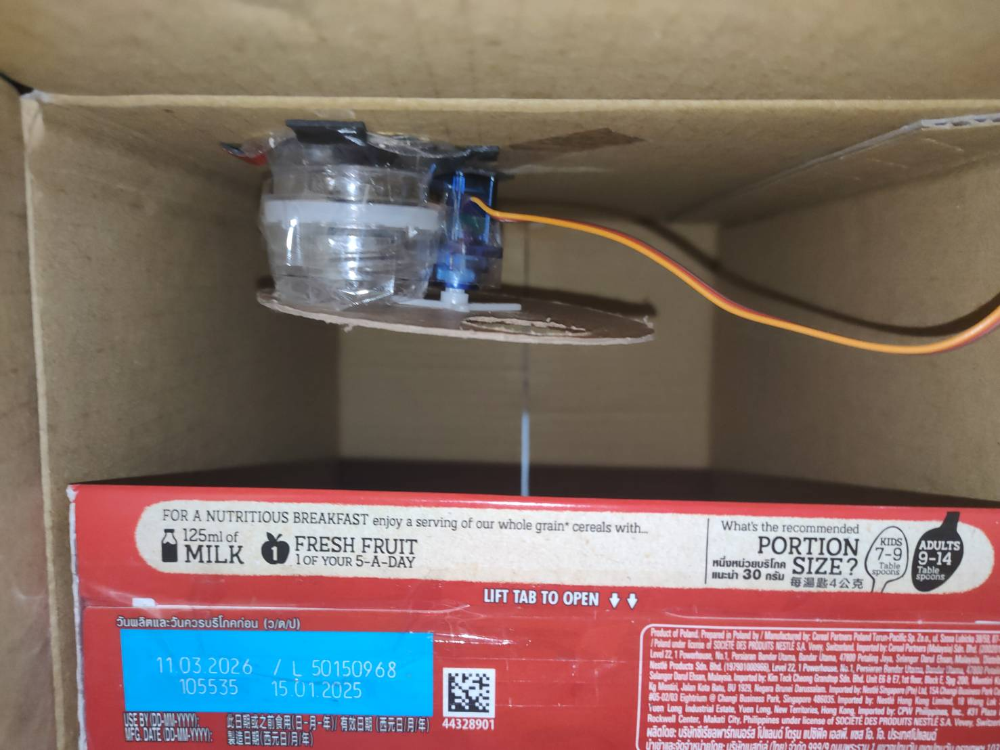

# 🐕 AI 智慧寵物餵食器 (Smart Pet Feeder)

An intelligent IoT pet feeder based on Raspberry Pi with AI breed recognition, precision weight measurement, and automatic feeding control.
(一個基於樹莓派的智慧寵物餵食系統，具備 AI 品種辨識、精準重量量測與自動餵食控制功能。)

---

## 📖 Table of Contents (目錄)
- [Project Overview](#-project-overview-專案目標)
- [Demo Video](#-demo-video-影片演示)
- [Key Features](#-key-features-核心功能)
- [System Architecture](#-system-architecture-系統架構)
- [Hardware Required](#-hardware-required-硬體需求)
- [Circuit Diagram](#-circuit-diagram-電路圖)
- [Software Prerequisites](#-software-prerequisites-軟體環境需求)
- [Installation & Setup](#-installation--setup-安裝教學)
- [How to Run](#-how-to-run-執行方式)
- [Load Cell Calibration](#-load-cell-calibration-重量校正)
- [Usage Guide](#-usage-guide-使用說明)
- [Project Structure](#-project-structure-專案結構)
- [Troubleshooting](#-troubleshooting-常見問題)

---

## 🎯 Project Overview (專案目標)

**Objective:**
This project aims to build an intelligent pet feeder that automatically recognizes pet breeds using AI, measures food weight precisely with a load cell, and dispenses the appropriate amount of food based on the pet's weight and nutritional requirements.

本專案旨在打造一個智慧寵物餵食器，能夠使用 AI 自動辨識寵物品種，透過高精度荷重元精準量測食物重量，並根據寵物體重和營養需求自動分配適量的食物。

**Technology Stack:**
- **AI/ML**: Intel OpenVINO™ Toolkit with MobileNet-V2 model
- **Hardware Control**: Raspberry Pi GPIO, HX711 Load Cell Amplifier
- **Web Framework**: Flask with real-time video streaming
- **Computer Vision**: OpenCV for image processing
- **Database**: SQLite for pet profile management

---

## 🎥 Demo Video (影片演示)

Here is a brief demonstration of how the device works and the project objectives.

實體照片




[demo影片](https://youtube.com/shorts/SOeuWDp56SY?feature=share)

---

## ⭐ Key Features (核心功能)

### 1. **AI 品種辨識 (AI Breed Recognition)**
- 使用 Intel Neural Compute Stick 2 (NCS2) 加速推論
- MobileNet-V2 模型可辨識 100+ 種狗狗品種
- 即時影像處理與品種分類 (信心度閾值 > 70%)

### 2. **精準重量測量 (Precision Weight Measurement)**
- HX711 24-bit ADC 高精度荷重元模組
- 自動零點校正 (Auto-taring)
- 扣除容器重量功能
- 即時重量監控與顯示

### 3. **智慧補料系統 (Smart Feeding System)**
- 根據寵物體重自動計算建議食量 (體重 × 2%)
- 時間控制式補料 (基於流速公式)
- 伺服馬達控制飼料閘門開關
- 多階段補料機制，確保精準投放

### 4. **Web 控制介面 (Web Control Interface)**
- 即時影像串流監控
- 系統狀態儀表板
- 寵物資料註冊與管理
- 手動上傳照片辨識品種功能

### 5. **資料庫管理 (Database Management)**
- SQLite 儲存寵物檔案
- 記錄寵物名稱、體重、品種ID、目標食量
- 支援多寵物資料管理

---

## 🏗 System Architecture (系統架構)

```
┌─────────────────────────────────────────────────────────┐
│                    Web Interface (Flask)                 │
│          Real-time Video Stream + Control Panel          │
└────────────────────┬────────────────────────────────────┘
                     │
        ┌────────────┴────────────┐
        │                         │
┌───────▼────────┐      ┌────────▼────────┐
│  AI Recognition │      │  Weight Sensor  │
│  (OpenVINO +    │      │    (HX711 +     │
│   NCS2)         │      │   Load Cell)    │
└───────┬─────────┘      └────────┬────────┘
        │                         │
        └────────────┬────────────┘
                     │
        ┌────────────▼────────────┐
        │   Decision Logic        │
        │   (Feed or Not?)        │
        └────────────┬────────────┘
                     │
        ┌────────────▼────────────┐
        │  Servo Motor Control    │
        │  (Dispense Food)        │
        └─────────────────────────┘
```

---

## 🛠 Hardware Required (硬體需求)

### 必要硬體 (Required):
* **Raspberry Pi 4B / 3B+** (running Raspberry Pi OS)
* **Intel Neural Compute Stick 2 (NCS2)** - AI 推論加速器
* **Raspberry Pi Camera Module (v1.3 or v2)** - 影像擷取
* **HX711 Load Cell Amplifier** - 重量感測器放大模組
* **Load Cell (5kg or 10kg)** - 荷重元 (秤重感測器)
* **Servo Motor (SG90 or MG90S)** - 伺服馬達 (控制飼料閘門)
* **5V/3A Power Supply** - 電源供應器
* **Breadboard and Jumper Wires** - 麵包板與杜邦線

### 選配 (Optional):
* 飼料儲存容器
* 3D列印或雷切外殼
* LED指示燈

---

## ⚡ Circuit Diagram (電路圖)

### Pin Connections (腳位連接):

| Component | Description | Raspberry Pi Pin (BCM) | Physical Pin |
|-----------|-------------|------------------------|--------------|
| **HX711** | | | |
| VCC | Power | 5V | Pin 2 |
| GND | Ground | GND | Pin 6 |
| DT | Data | GPIO 23 | Pin 16 |
| SCK | Clock | GPIO 24 | Pin 18 |
| **Servo Motor** | | | |
| VCC | Power | 5V | Pin 4 |
| GND | Ground | GND | Pin 9 |
| Signal | PWM Control | GPIO 18 | Pin 12 |
| **Pi Camera** | | CSI Port | N/A |
| **NCS2** | | USB 3.0 Port | N/A |

### Schematic (電路原理圖)
```
Raspberry Pi                HX711                Load Cell
  GPIO 23 ────────────────► DT
  GPIO 24 ────────────────► SCK
  5V      ────────────────► VCC                  
  GND     ────────────────► GND                  ┌───────┐
                            E+ ─────────────────►│   +   │
                            E- ─────────────────►│   -   │
                            A+ ─────────────────►│   A+  │
                            A- ─────────────────►│   A-  │
                                                 └───────┘
Raspberry Pi                Servo Motor
  GPIO 18 ────────────────► Signal (Yellow/Orange)
  5V      ────────────────► VCC (Red)
  GND     ────────────────► GND (Brown/Black)
```


---

## 💻 Software Prerequisites (軟體環境需求)

**作業系統 (Operating System):** Raspberry Pi OS (Bullseye 或更新版本)  
**Python 版本:** Python 3.7+  
**硬體需求:** Intel Neural Compute Stick 2 (NCS2) - 需安裝 OpenVINO Runtime

### ⚠️ 重要：啟用相機介面
本專案使用 **Raspberry Pi Camera Module**，您必須先啟用相機介面：

```bash
# 使用 raspi-config 啟用相機
sudo raspi-config
# 路徑：Interface Options -> Camera -> Enable
# 重新啟動樹莓派
sudo reboot
```

### 安裝 OpenVINO Runtime
本專案需要 OpenVINO 來執行 NCS2 推論：

```bash
# 安裝 OpenVINO runtime
pip install openvino
```

---

## ⚙️ Installation & Setup (安裝教學)

### 步驟 1: 複製專案儲存庫
```bash
git clone https://github.com/SinBoYang/smart-feeder.git
cd smart-feeder
```

### 步驟 2: 安裝 Python 依賴套件
安裝所有必要的 Python 套件：
```bash
pip3 install -r requirements.txt
```

### 步驟 3: 初始化資料庫
建立用於儲存寵物資料的 SQLite 資料庫：
```bash
python3 init_db.py
```

### 步驟 4: 下載 AI 模型（如果未包含）
本專案使用 Intel OpenVINO Model Zoo 的 MobileNet-V2 模型。如果模型檔案未包含，請下載：
```bash
# 模型應該位於：models/public/mobilenet-v2/FP16/
# mobilenet-v2.xml 和 mobilenet-v2.bin
```

---

##  How to Run (執行方式)

### 步驟 1: 校正荷重元（僅首次使用）
**重要：** 首次使用前必須校正荷重元！

詳細說明請參閱下方的 [荷重元校正](#-load-cell-calibration-重量校正) 章節。

### 步驟 2: 啟動應用程式
```bash
python3 app.py
```

應用程式將會：
1. 初始化硬體（HX711、伺服馬達）
2. 在 NCS2 上載入 AI 模型
3. 啟動 Flask 網頁伺服器（port 5000）
4. 開始影像串流和監控

### 步驟 3: 存取網頁介面
開啟瀏覽器並導航至：
```
http://<樹莓派IP>:5000
```

例如：
```
http://192.168.1.100:5000
```

---

##  Load Cell Calibration (重量校正)

**為什麼需要校正：**
每個荷重元都有些許差異，您需要校正才能獲得準確的重量測量。

### 方法 1: 使用 test_weight.py（推薦）
此腳本自動執行校正流程：

```bash
python3 test_weight.py
```

**步驟：**
1. 腳本會提示您清空荷重元（淨空）
2. 記錄零點偏移值
3. 放置已知重量的物品（例如：0.2kg 手機、1kg 水瓶）
4. 腳本計算參考因子
5. 將數值複製到 `app.py`：
   - `ZERO_OFFSET`（零點偏移）
   - `FINAL_REFERENCE_FACTOR`（參考因子）

### 方法 2: 手動校正
如果您偏好手動校正：

```bash
python3 get_reference.py
```

1. **清空秤盤** 並執行腳本以獲取原始讀數
2. **放置已知重量** 的物品（例如：200g 手機）
3. 記錄原始數值差異
4. 計算：`REFERENCE_FACTOR = (有重量的原始值 - 空秤原始值) / 實際重量(kg)`

### 方法 3: 使用 calibration.py
用於互動式伺服馬達 + 秤重測試：

```bash
python3 calibration.py
```

這讓您可以：
- 測試伺服馬達角度
- 即時測量重量
- 微調系統

### 更新 app.py 的校正數值
校正完成後，編輯 `app.py` 並更新：

```python
# Line 14-16
ZERO_OFFSET = 392502           # Your zero offset value
FINAL_REFERENCE_FACTOR = 438760   # Your reference factor
BOX_WEIGHT = 0.01              # Container weight to subtract
```

---

##  Usage Guide (使用說明)

### 1. 註冊新寵物

1. 點擊 **"上傳照片辨識"** 按鈕
2. 上傳清晰的寵物照片
3. AI 將會辨識品種
4. 填寫表單：
   - **寵物名稱** (Pet Name)
   - **體重 (kg)** (Pet Weight)
   - 品種 ID 和名稱會自動填入
5. 點擊 **"儲存寵物資料"** 儲存

### 2. 開始自動餵食

1. 點擊 **"啟動系統"** 按鈕
2. 攝影機將持續監控寵物
3. 當偵測到已註冊的寵物時：
   - 系統檢查目前食物重量
   - 如果重量 < 目標（體重的 2%），開始餵食
   - 伺服馬達開啟、分配食物、關閉
   - 重複此過程直到達到目標重量

### 3. 監控系統狀態

儀表板顯示：
- **即時影像**：即時影像串流
- **目前重量**：目前食物重量（公斤）
- **辨識結果**：偵測到的寵物名稱和品種
- **補料建議**：建議補充的食物量和時間

### 4. 餵食邏輯

系統計算方式：
- **目標食物重量** = 寵物體重 × 2% (FEED_RATIO)
- **缺少重量** = 目標 - 目前重量
- **餵食時間** = 缺少重量 ÷ 流速 (0.05 kg/秒)

範例：
- 寵物體重：10 kg
- 目標：0.2 kg
- 目前：0.05 kg
- 缺少：0.15 kg
- 餵食時間：3 秒

---

##  Project Structure (專案結構)

```
smart-feeder/

 app.py                  # Main Flask application
 calibration.py          # Interactive calibration tool
 get_reference.py        # Manual reference value getter
 hx711.py               # HX711 driver library
 init_db.py             # Database initialization
 test_loadcell.py       # Load cell testing
 test_weight.py         # Automated calibration script
 requirements.txt       # Python dependencies
 README.md             # This file

 models/
    imagenet_classes.txt        # ImageNet class labels
    public/
        mobilenet-v2/
            mobilenet-v2.caffemodel
            mobilenet-v2.prototxt
            FP16/
                mobilenet-v2.xml    # OpenVINO IR model
                mobilenet-v2.bin    # Model weights
                mobilenet-v2.mapping

 templates/
    index.html         # Web interface

 feeder.db              # SQLite database (created after init_db.py)
```

### 主要檔案說明：

- **app.py**：主應用程式，包含 Flask 路由、AI 推論、餵食邏輯
- **hx711.py**：HX711 荷重元放大器驅動程式
- **init_db.py**：建立包含寵物資料表的 SQLite 資料庫
- **test_weight.py**：最佳校正工具 - 自動化流程
- **calibration.py**：伺服馬達 + 荷重元的手動測試工具
- **index.html**：網頁介面，包含即時影像、控制和狀態顯示

---

##  Configuration Parameters (可調參數)

在 `app.py` 中編輯這些參數以自訂系統行為：

```python
# GPIO Pins
DT_PIN = 23              # HX711 Data pin
SCK_PIN = 24             # HX711 Clock pin
SERVO_PIN = 18           # Servo control pin

# Calibration Values (MUST UPDATE after calibration!)
ZERO_OFFSET = 392502            
FINAL_REFERENCE_FACTOR = 438760   
BOX_WEIGHT = 0.01        # Container weight (kg)

# Feeding Parameters
FEED_RATIO = 0.02        # Target food = Pet weight  2%
FLOW_RATE = 0.05         # Dispensing speed (kg/sec)
OFFSET_WEIGHT = 0.02     # Safety margin
COOLDOWN_TIME = 60       # Seconds before next feeding
FEED_INTERVAL_WAIT = 5.0 # Stabilization time between cycles

# Servo Angles
SERVO_OPEN = 90          # Servo angle when open
SERVO_CLOSE = 0          # Servo angle when closed
```

---

##  Troubleshooting (常見問題)

### 問題：NCS2 未偵測到
**解決方案：**
```bash
# 檢查 NCS2 是否連接
lsusb | grep Movidius

# 重新安裝 OpenVINO
pip3 install --upgrade openvino
```

### 問題：HX711 回傳 0 或數值不穩定
**解決方案：**
- 檢查接線（DT、SCK、VCC、GND）
- 確保荷重元正確連接到 HX711（E+、E-、A+、A-）
- 重新執行校正：`python3 test_weight.py`
- 在 VCC 和 GND 之間加裝電容（10uF）以增加穩定性

### 問題：伺服馬達不動作
**解決方案：**
- 檢查 GPIO 18 連接
- 確認伺服馬達有正確的 5V 電源供應
- 在 `calibration.py` 中手動測試伺服馬達
- 檢查 PWM 訊號：嘗試不同的脈衝寬度

### 問題：重量讀數為負值或不正確
**解決方案：**
- 執行校正：`python3 test_weight.py`
- 更新 `app.py` 中的 `ZERO_OFFSET` 和 `FINAL_REFERENCE_FACTOR`
- 調整 `BOX_WEIGHT` 以符合您的容器重量
- 確保荷重元安裝穩固，無干擾

### 問題：AI 無法辨識寵物
**解決方案：**
- 確保 NCS2 正確連接
- 檢查模型檔案是否存在於 `models/public/mobilenet-v2/FP16/`
- 改善光線條件
- 確保寵物在畫面中清晰可見
- 如需要，可降低信心度閾值（目前為 0.7）

### 問題：Flask 伺服器無法啟動
**解決方案：**
```bash
# 檢查 port 5000 是否被使用
sudo lsof -i :5000

# 終止使用 port 5000 的程序
sudo kill -9 <PID>

# 或在 app.py 中更改 port：
# app.run(host='0.0.0.0', port=8080, ...)
```

### 問題：Pi Camera 無法運作
**解決方案：**
```bash
# 在 raspi-config 中啟用相機
sudo raspi-config
# Interface Options -> Camera -> Enable -> Reboot

# 測試 Pi Camera
raspistill -o test.jpg

# 驗證相機是否被偵測
vcgencmd get_camera
# 應該回傳：supported=1 detected=1

# 檢查相機排線連接
# 確保它牢固地連接到 CSI port
# 藍色那面應該朝向網路孔
```

---

##  Safety Features (安全機制)

1. **緊急停止**：偵測到重量異常時系統停止餵食
2. **冷卻期**：餵食之間等待 60 秒以防止過度餵食
3. **穩定時間**：每個分配週期後等待 5 秒以進行精準測量
4. **執行緒安全操作**：鎖定機制防止同時餵食
5. **零點鉗位**：負重量會被鉗位至零

---

##  Future Improvements (未來改進方向)

-  新增餵食歷史和分析
-  多寵物排程（基於時間的餵食）
-  手機應用程式整合
-  Email/LINE 通知
-  溫濕度監控
-  每隻寵物的自訂餵食時程
-  語音控制整合
-  寵物資料雲端備份

---

##  References & Citations (參考資料)

* [Intel OpenVINO Toolkit](https://docs.openvino.ai/)
* [HX711 Load Cell Amplifier Datasheet](https://cdn.sparkfun.com/datasheets/Sensors/ForceFlex/hx711_english.pdf)
* [Raspberry Pi GPIO Documentation](https://www.raspberrypi.org/documentation/usage/gpio/)
* [MobileNet-V2 Paper](https://arxiv.org/abs/1801.04381)
* [Flask Documentation](https://flask.palletsprojects.com/)

---


##  Author (作者)

**SinBoYang**  
GitHub: [@SinBoYang](https://github.com/SinBoYang)

**Project Date:** December 2025  
**Repository:** [smart-feeder](https://github.com/SinBoYang/smart-feeder)

---

